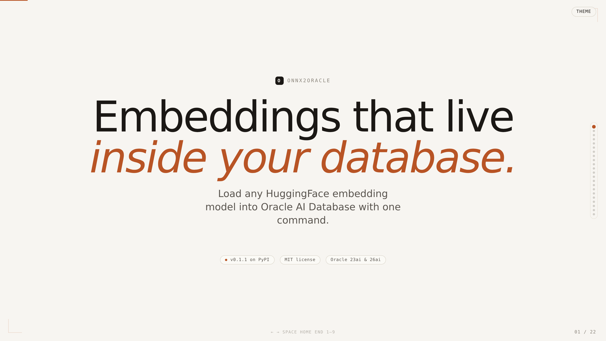
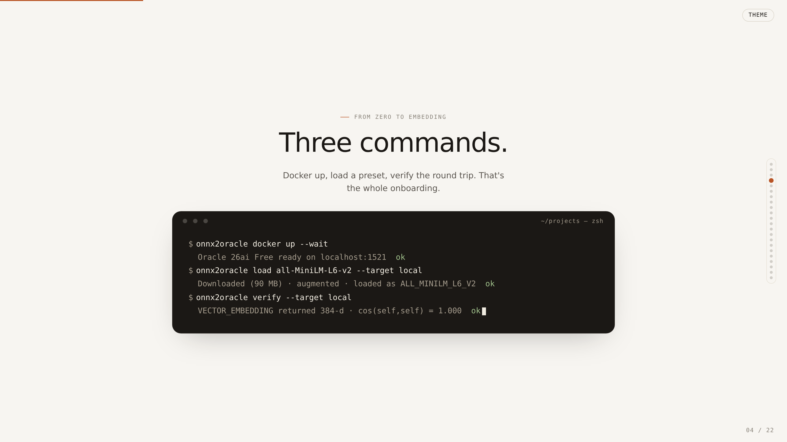
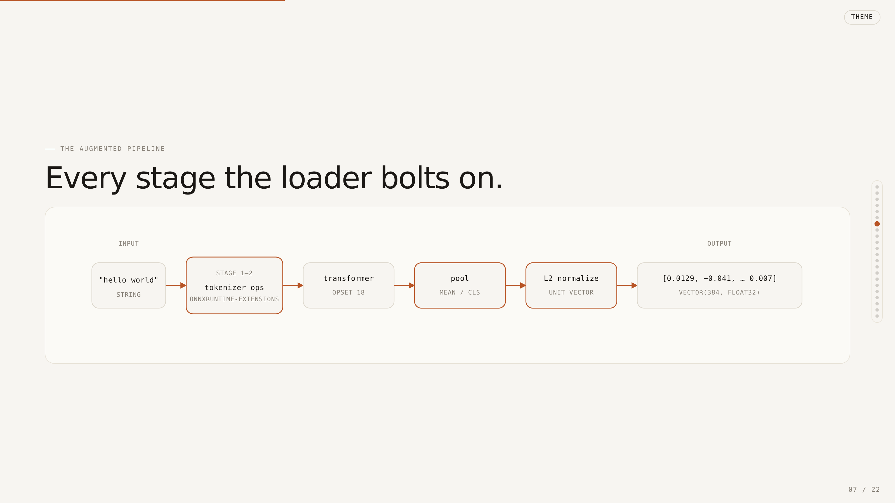
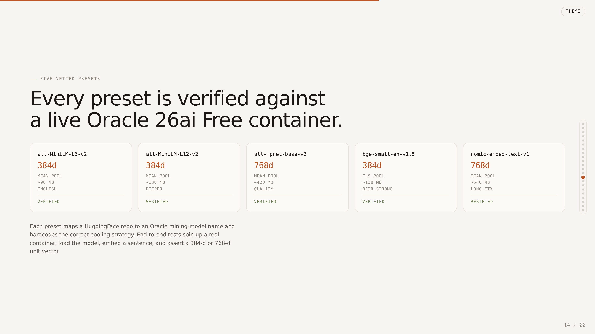
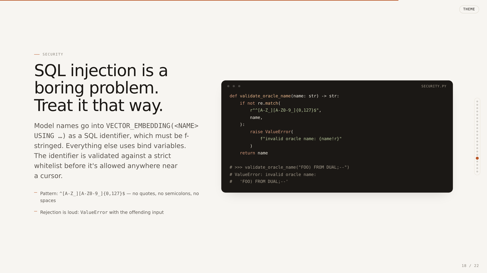
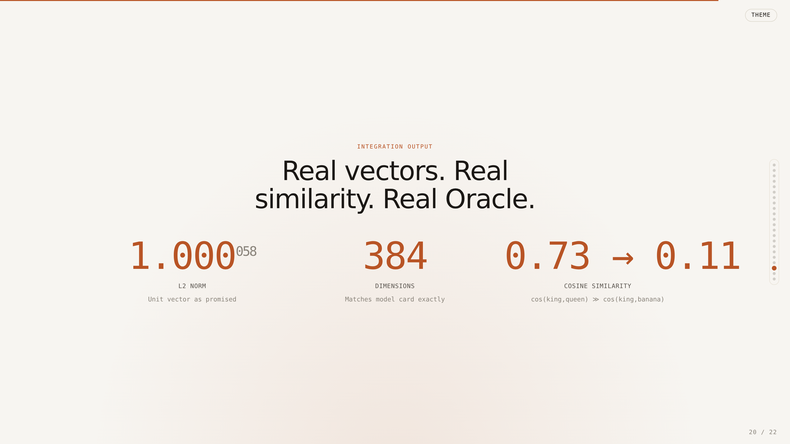

<h1 align="center">onnx2oracle</h1>

<p align="center">
  <strong>Load ONNX embedding models into Oracle AI Database with one command.</strong> Zero network round-trips. Embeddings generated inside the DB.
</p>

<p align="center">
  
  
  
  <a href="https://pypi.org/project/onnx2oracle/"></a>
  <a href="https://jasperan.github.io/onnx2oracle/"></a>
  <a href="LICENSE"></a>
</p>

<p align="center">
  <a href="https://github.com/jasperan/onnx2oracle/actions/workflows/ci.yml"></a>
  <a href="https://github.com/jasperan/onnx2oracle/actions/workflows/pages.yml"></a>
</p>

---

`onnx2oracle` ships HuggingFace sentence-transformer models straight into **Oracle AI Database 26ai** via `DBMS_VECTOR.LOAD_ONNX_MODEL`. Once the model is registered, `VECTOR_EMBEDDING(MODEL USING :text AS DATA)` runs the full tokenizer, transformer, pooling, and L2 normalization entirely in-database. No external embedding API, no sidecar serving layer, no PII leaking to third parties.

## Deck at a Glance

> **Full interactive presentation**: open [`docs/presentation.html`](docs/presentation.html) in a browser for all 22 slides with arrow-key navigation, 1-9 jumps, and a light/dark toggle.

<table>
<tr>
<td align="center"><strong>Title</strong><br></td>
<td align="center"><strong>3-Command Demo</strong><br></td>
</tr>
<tr>
<td align="center"><strong>Augmented Pipeline</strong><br></td>
<td align="center"><strong>Supported Presets</strong><br></td>
</tr>
<tr>
<td align="center"><strong>Security</strong><br></td>
<td align="center"><strong>Proof It Works</strong><br></td>
</tr>
</table>

## Why Oracle AI Database?

- **In-database ONNX embeddings**: run the full pipeline with `VECTOR_EMBEDDING()`. Zero network latency. No API keys to rotate.
- **AI Vector Search**: semantic recall via `VECTOR_DISTANCE()` with COSINE, EUCLIDEAN, or DOT similarity.
- **ACID-native**: embedding writes are part of your transactions. Crash-safe by default.
- **Data locality**: text never leaves your database. No third-party terms of service to chase.
- **Free locally**: [Oracle AI Database 26ai Free](https://www.oracle.com/database/free/) runs in a Docker container with full vector support.

## The Augmented Pipeline

HuggingFace ships a Python tokenizer object. Oracle needs a self-contained ONNX graph it can call from SQL. `onnx2oracle` bridges the gap in 6 stages:

1. **Download** the core transformer ONNX via `huggingface_hub`.
2. **Wrap the tokenizer** as ONNX ops via `onnxruntime_extensions.gen_processing_models`.
3. **Align opsets** (bump core to 18) and **merge** via `onnx.compose.merge_models` with `prefix1="pre_"`.
4. **Pool**: `ReduceMean(axis=1)` for mean pooling, `Gather(axis=1, [0]) + Squeeze` for CLS.
5. **L2-normalize**: `Pow(2) → ReduceSum(-1) → Sqrt → Max(eps=1e-12) → Div`.
6. **Upload**: `DBMS_VECTOR.LOAD_ONNX_MODEL(model_name, model_data, metadata)` with raw bytes. No filesystem staging.

Result: a single ONNX graph with input `pre_text: string` and output `embedding: float32[dims]` that Oracle invokes row by row.

## Quick Start

### Prerequisites

- Python 3.10+
- Docker (for the local [Oracle AI Database 26ai Free](https://www.oracle.com/database/free/) container) or any Oracle 23ai/26ai instance
- ~2 GB free RAM during model augmentation; ~1 GB DB storage per preset

### 1. Install

```bash
pip install onnx2oracle
```

### 2. Start Oracle

```bash
onnx2oracle docker up --wait
```

First start is slow (3-5 min while the PDB opens). Subsequent starts are ~30 seconds. The wait is a
bounded SQL probe; override it with `--wait-timeout SECONDS` if your Docker host is slow.

### 3. Preflight the DB

```bash
onnx2oracle preflight --target local
```

### 4. Load a model

```bash
onnx2oracle load all-MiniLM-L6-v2 --target local
```

### 5. Verify

```bash
onnx2oracle verify --target local
# ✓ Connected
# ✓ Model ALL_MINILM_L6_V2 registered
# ✓ Sample embedding: 384 dims (norm=1.0000)
# ✓ Similarity sanity (king/queen > king/banana)
```

### 6. Query

```sql
SELECT VECTOR_EMBEDDING(ALL_MINILM_L6_V2 USING 'hello world' AS DATA) AS v
FROM dual;
```

## Presets

Five curated presets are included. Use `scripts/check_model_compatibility.py --all-presets` to
refresh real-DB pass/fail evidence in your environment.

<!-- BEGIN: preset-table -->
| Preset | HuggingFace repo | Dims | Size (FP32) | Pooling | Oracle name |
|---|---|---|---|---|---|
| `all-MiniLM-L6-v2` | sentence-transformers/all-MiniLM-L6-v2 | 384 | ~90 MB | mean | `ALL_MINILM_L6_V2` |
| `all-MiniLM-L12-v2` | sentence-transformers/all-MiniLM-L12-v2 | 384 | ~130 MB | mean | `ALL_MINILM_L12_V2` |
| `all-mpnet-base-v2` | sentence-transformers/all-mpnet-base-v2 | 768 | ~420 MB | mean | `ALL_MPNET_BASE_V2` |
| `bge-small-en-v1.5` | BAAI/bge-small-en-v1.5 | 384 | ~130 MB | cls | `BGE_SMALL_EN_V1_5` |
| `nomic-embed-text-v1` | nomic-ai/nomic-embed-text-v1 | 768 | ~540 MB | mean | `NOMIC_EMBED_TEXT_V1` |
<!-- END: preset-table -->

Any sentence-transformer-style model also works via `--from-huggingface`:

```bash
onnx2oracle load --from-huggingface BAAI/bge-base-en-v1.5 \
  --pooling cls --normalize --dims 768 --name BGE_BASE_EN_V1_5
```

**Known limitation**: SentencePiece-based multilingual models (like `intfloat/multilingual-e5-small`) can't round-trip to Oracle's BertTokenizer op. `onnx2oracle` raises a clear `NotImplementedError` pointing at WordPiece alternatives.

## CLI Reference

```
onnx2oracle version
onnx2oracle presets                    # List the 5 curated presets
onnx2oracle docker up [--wait] [--wait-timeout 600] [--wait-interval 5]
onnx2oracle docker down [--volumes]    # Stop + remove container, optionally remove DB volume
onnx2oracle docker logs [-f]           # Tail container logs

onnx2oracle load <preset> [--target local | --dsn ...] [--force]
onnx2oracle load --from-huggingface <repo> --pooling {mean,cls} \
                 --dims N --name ORACLE_NAME [--target local | --dsn ...]

onnx2oracle preflight [--target local | --dsn ...]
onnx2oracle verify [--target local | --dsn ...] [--name ORACLE_NAME]

onnx2oracle config show
onnx2oracle config set key=value       # Write to ~/.onnx2oracle/config.toml
```

## DSN Resolution

Connections resolve in this order:

1. `--dsn user/pw@host:port/service` flag
2. `ORACLE_DSN` env var
3. `~/.onnx2oracle/config.toml` (`[default] dsn = "..."`)
4. `--target local` shortcut (`system/${ORACLE_PWD:-onnx2oracle}@localhost:${ORACLE_PORT:-1521}/FREEPDB1`)
5. Interactive prompt (password masked)

If none of the above are set, the CLI auto-defaults to `--target local` for a painless docker-compose workflow.

## Environment Variables

| Variable | Description | Default |
|---|---|---|
| `ORACLE_DSN` | Full DSN: `user/password@host:port/service` | — |
| `ORACLE_PWD` | Password for the docker-compose container and `--target local` | `onnx2oracle` |
| `ORACLE_PORT` | Host port for the local Docker listener and `--target local` | `1521` |
| `ORACLE_IMAGE` | Docker image used by the bundled compose file | `container-registry.oracle.com/database/free:latest` |
| `HF_HOME` | HuggingFace cache directory | `~/.cache/huggingface` |
| `HF_TOKEN` | HuggingFace API token (for gated models) | — |

## Architecture

```
onnx2oracle/
├── src/onnx2oracle/
│   ├── cli.py           # Typer commands: load, verify, presets, docker, config
│   ├── presets.py       # 5 curated ModelSpecs
│   ├── connection.py    # DSN resolution (CLI > env > toml > target > prompt)
│   ├── pipeline.py      # HF model -> augmented ONNX bytes (tokenizer + pool + L2)
│   ├── loader.py        # DBMS_VECTOR.LOAD_ONNX_MODEL wrapper with idempotency
│   ├── verify.py        # Smoke test via VECTOR_EMBEDDING + cosine sanity
│   ├── _ident.py        # Oracle identifier whitelist (SQL-injection guard)
│   └── data/
│       └── docker-compose.yml   # Shipped in the wheel, honors ORACLE_PWD
├── docker/
│   └── docker-compose.yml       # Dev-only copy for git clone workflow
├── docs/                         # GitHub Pages site + 22-slide presentation
├── tests/                        # 19 unit + 2 slow + 1 integration test
└── .github/workflows/            # CI matrix (3.10/3.11/3.12) + Pages deploy
```

## Testing

```bash
git clone https://github.com/jasperan/onnx2oracle.git
cd onnx2oracle
conda create -n onnx2oracle python=3.12 -y
conda activate onnx2oracle
pip install -e ".[dev]"

pytest tests/ -v -m "not slow and not integration"   # 19 unit tests, seconds

# Slow tests (real HF downloads, no DB):
pytest tests/test_pipeline.py -v -m slow

# Integration test against a live Oracle 26ai Free container:
ORACLE_DSN='system/yourpw@localhost:1521/FREEPDB1' \
  pytest tests/test_loader_integration.py --run-integration -v

# One-command local evidence run: start Oracle, record DB evidence, load MiniLM,
# verify VECTOR_EMBEDDING, and run the live integration test.
scripts/run_real_db_integration.sh

# Model compatibility evidence: build, load, verify, clean up, and write JSONL.
ORACLE_PORT=1524 scripts/check_model_compatibility.py all-MiniLM-L6-v2
```

The evidence runner writes logs under `integration-artifacts/`. Set `ORACLE_PORT=1524` if 1521 is
already occupied, `ORACLE_IMAGE` to switch images, `ONNX2ORACLE_WAIT_TIMEOUT=1200` for slower first
starts, and `ONNX2ORACLE_CLEANUP=down` or `ONNX2ORACLE_CLEANUP=volumes` when you want the script to
stop or remove the database after the run.

## Security

- **SQL-identifier whitelist** (`^[A-Z_][A-Z0-9_]{0,127}$`) on every model name before it's interpolated into `VECTOR_EMBEDDING`. Bind variables are used for all other parameters.
- Oracle's `VECTOR_EMBEDDING` takes the model identifier as a SQL token (not bindable), so the whitelist is the guardrail. Attempted injections raise `ValueError` before the query runs.
- No wallet files or secrets are ever committed. The `docker-compose.yml` honors `ORACLE_PWD` so you can override the local-dev default.

## Sister Projects

- [PicoOraClaw](https://github.com/jasperan/picooraclaw) — Go-based autonomous agent on Oracle 26ai
- [IronOraClaw](https://github.com/jasperan/ironoraclaw) — Rust secure AI assistant on Oracle 26ai
- [ZeroOraClaw](https://github.com/jasperan/zerooraclaw) — Rust zero-overhead agent on Oracle 26ai
- [OracLaw](https://github.com/jasperan/oraclaw) — TypeScript + Python sidecar on Oracle 26ai
- [TinyOraClaw](https://github.com/jasperan/tinyoraclaw) — TypeScript multi-agent on Oracle 26ai

## Credits

- [Oracle AI Database 26ai Free](https://www.oracle.com/database/free/) — the in-database ONNX runtime
- [HuggingFace](https://huggingface.co/) — the model and tokenizer ecosystem
- [onnxruntime-extensions](https://github.com/microsoft/onnxruntime-extensions) — tokenizer as ONNX ops
- [python-oracledb](https://oracle.github.io/python-oracledb/) — the thin-mode driver

## License

MIT.

---

<div align="center">

[](https://github.com/jasperan)&nbsp;
[](https://www.linkedin.com/in/jasperan/)&nbsp;
[](https://www.oracle.com/database/free/)

</div>
